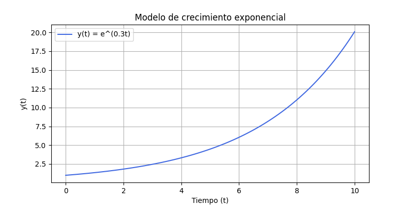
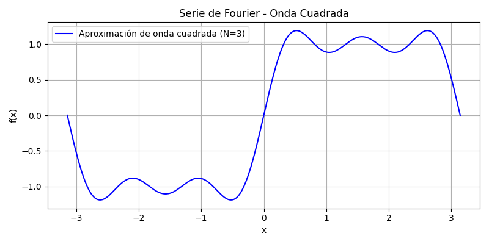
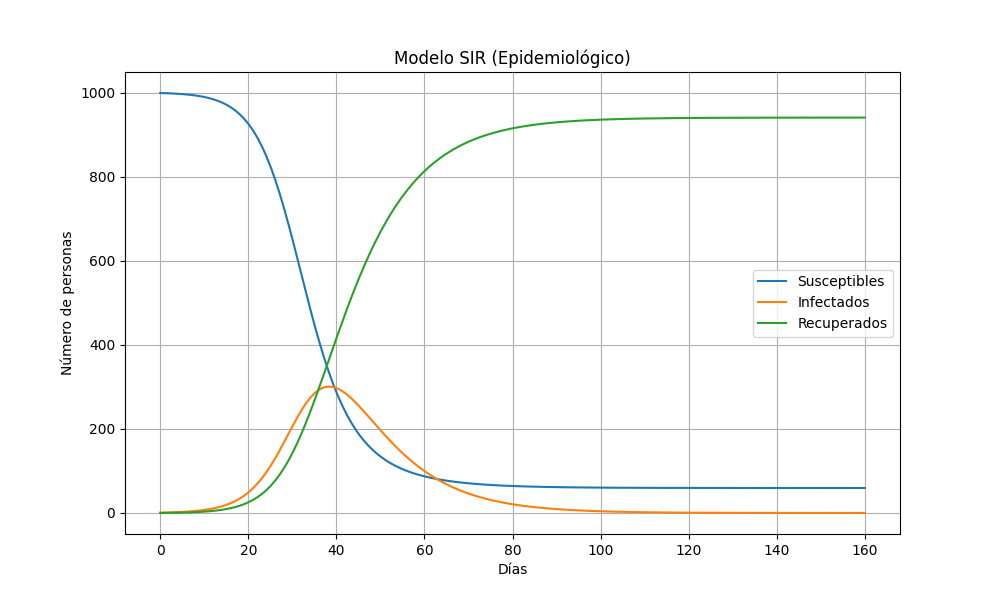
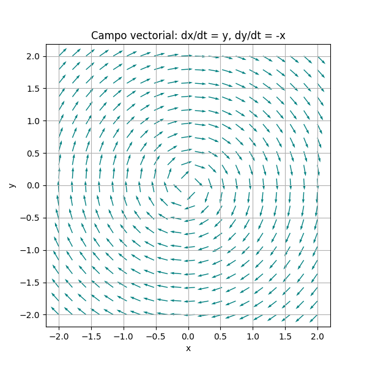

# Visualización de Modelos Matemáticos

Este repositorio contiene una colección de visualizaciones de modelos matemáticos usando Python y librerías como `matplotlib`, `numpy` y `scipy`. El objetivo es reforzar la interpretación visual de conceptos clave en matemáticas aplicadas, como ecuaciones diferenciales y series.

## Estructura

Cada archivo `.py` corresponde a un modelo o tema matemático diferente. Los resultados se guardan como imágenes en la carpeta `plots/`.

---

## Modelos implementados

### 📈 modelo_exponencial.py

Simula el crecimiento exponencial de una población a lo largo del tiempo.  
Incluye visualización de la función `P(t) = P₀ * e^(rt)`.



---

### 🔁 serie_fourier.py

Aproximación por series de Fourier de una función periódica escalonada.  
Se visualiza cómo la serie converge al sumar más términos.



---

### 🦠 modelo_sir.py

Modelo SIR clásico de epidemiología.  
Simula la propagación de una enfermedad en una población cerrada.



---

### 🌪️ campo_vectorial.py

Visualización de un campo vectorial no lineal en 2D, con trayectorias que representan posibles soluciones a un sistema dinámico.



---

## Requisitos

- Python 3.11+
- numpy
- matplotlib
- scipy

Instala todo con:

```bash
pip install -r requirements.txt

---

## Licencia

Este proyecto es de uso personal y educativo. Puedes usar el código como base para tus propios ejercicios.